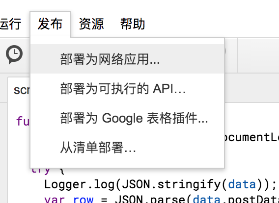
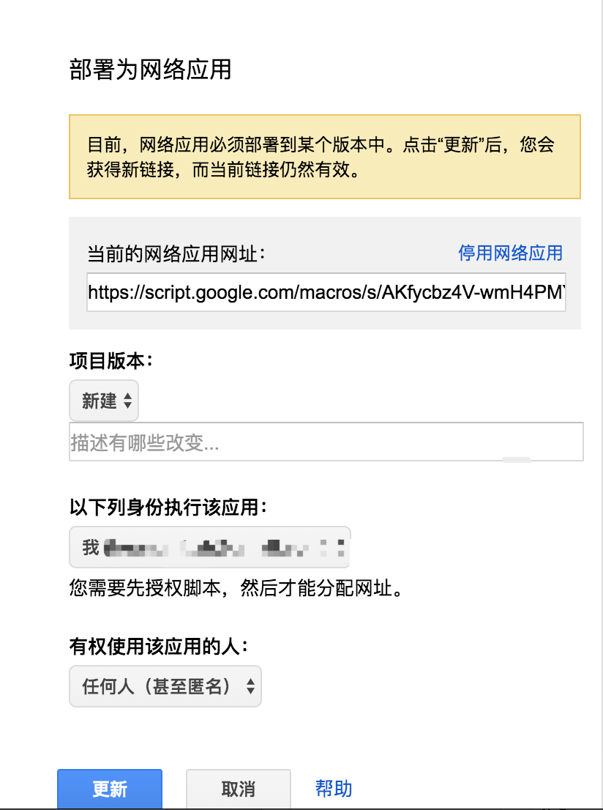

# 追踪 GitHub PR review 记录

使用 chrome 插件追踪 GitHub PR review 记录，并把数据存放在 Google Spreadsheet。

## 为啥要搞这个

最近公司项目组推行了一个规定：周报里面要把 Review 过的 PR 填上。作为有尊严的程序员，我们肯定是想自动化地来做。可惜试了下 GitHub 的 API 之后发现有几个蛋疼的问题，主要是如果 review 完了没有 comment 直接 approve 的话查不到记录（其实能，但是会很麻烦）。

于是我就想搞个 chrome 插件来统计，有个额外的 bonus 是可以（粗略）统计 review 每个 PR 花的时间，当然了最主要的原因是我没写过 chrome 插件，想玩一玩。

另外一个问题是，我会用多个电脑工作，很自然地需要一个服务器来同步数据，也为了好玩点，我决定把数据给存在 Google Spreadsheet 上。

## 怎么做的

先说一下 chrome 插件部分，大体上就是判断是 Pull Request 页面后触发一个定时器，每分钟检查一下，如果在 review 就把相关信息 POST 到服务端记条日志。判断在 review 的标准是一分钟内在 /pull/xxx/files 页面有过点击鼠标，或者按键，或者 scroll 操作。另外点击插件 icon 的时候打开一个新 tab 查询 review 统计信息，默认查最近一周的记录（包含当天）。

Spreadsheet 这边就是一空白的表格加两段 Google App Script。`doPost` 负责接收 review 记录，记在表格里。`doGet` 负责汇总一段时间内的记录。

## 手把手安装教程

这个步骤略麻烦，坦率地讲并不是真推荐给你用，更多地是展示一下怎么把 chrome extension + app script + spread sheet 这套前端+后端+数据库的技术栈给跑起来。

首先是数据库，用 [这个链接](https://docs.google.com/spreadsheets/d/12w6E9IZsLP58mYbqjE-cOaVtIx--UIocuGM_MihIWdI/copy) 创建一份 SpreadSheet 副本即可，标题可以随便改一个你认为合适的名字。

然后，打开“脚本编辑器”。

你会在新的页面里看到我预先写好的 App Script，也就是服务器端的代码啦。不关心的话就不用管代码，直接发布成网络应用。

注意，“项目版本”选“新建”，“有权使用该应用的人”选择“任何人（甚至匿名）”。

这时不出意外的话会提示需要授权 app 访问表格，依照提示操作即可。注意下图这里需要先点“高级”，然后“转到 recorder server（不安全）”，最后选择“允许”进行授权。

一顿操作之后就会看到已部署为网络应用的提示，这就说明服务端已经完成啦，我们把应用的网址拷贝下来备用。

接着是客户端，也就是 chrome 插件的部分了。你需要把本项目 clone 或下载到本地。编辑 `chrome-extension/config.js` 文件，把 SCRIPT_APP_URL 改成刚才复制的 URL，把 IGNORE_AUTHOR_ID 改成你自己的 GitHub ID（这个是为了防止自己的 PR 被记录），RECORD_INTERVAL 是上报的间隔一般不用改。

最后一步，安装插件。打开插件页面(地址栏输入 chrome://extensions)，点击“加载已解压的扩展程序”，选择 `chrome-extension` 目录进行安装，成功后如图。

这样就完成了，PR review 历史会被自动记录在 SpreadSheet 里，点击插件的图标可以看到最近一周的统计。

## 总结一下

这个套玩意儿亲测好用，我已经跑了一周了，下面是我这边统计的结果和一周汇总，看起来~~极大地~~解放了生产力。

其实还是有不少问题的，比如1分钟的间隔可能有些长，容易统计漏，还有时不时去看一些很老的 PR 时也会被记录在案。当然了我主要性质是玩票，也就不在意这些细节了。

通过这次尝试，我发现 Google App script 这一套可玩性还是很高的。毕竟 G suite 集邮件，文档，表格，演示文稿，网盘，日程，任务管理，甚至调查问卷等等等等于一体，App Script 提供了丰富强大的 API，使用应用之间可以互联互通，你还可以创建简单 Json API server 或是 HTTP server。最关键的是这些还全都不要钱。

最大的问题可能就是慢了，只适合处理低频小数据。我感觉可能适合通过 IFTTT 等工具把个人数据给灌进 spreadsheet，然后搞一些后台脚本跟 G suite 发生互动，还可以接 Google chart 做成 metrics 进行分析啥的，有时间可以试试。
